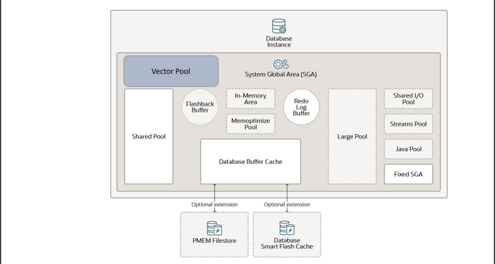
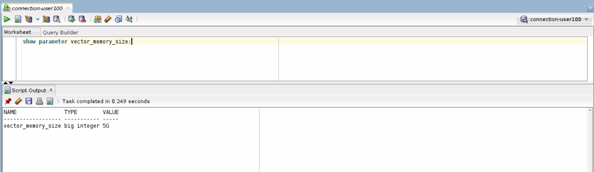
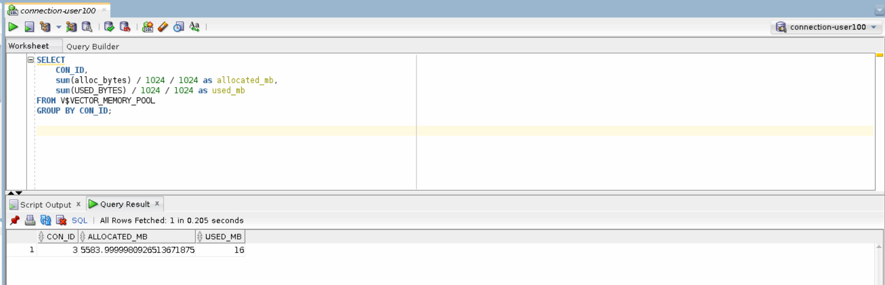
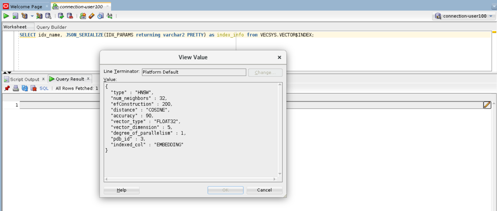
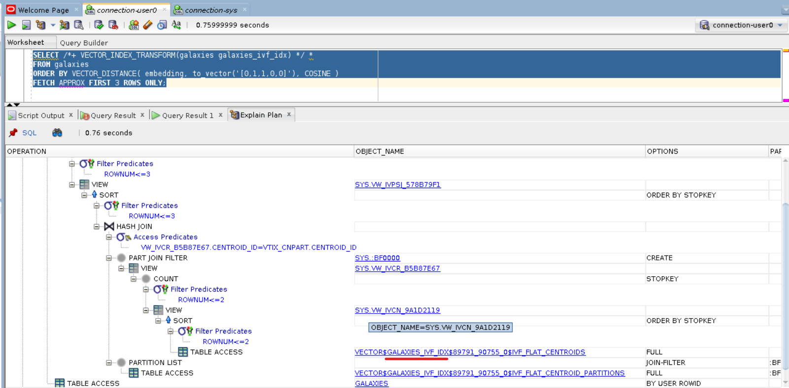
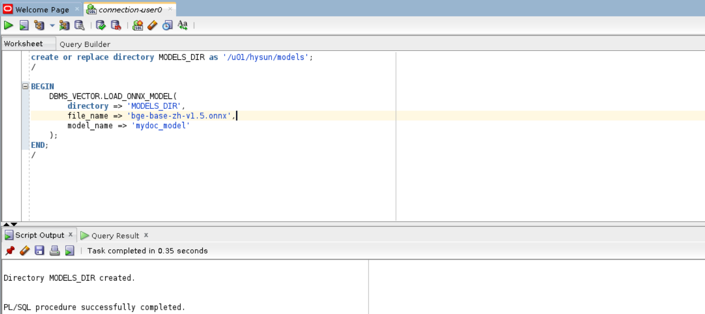
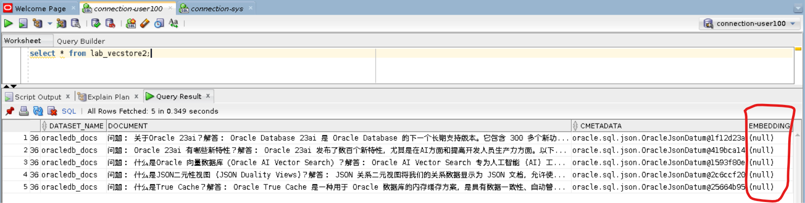
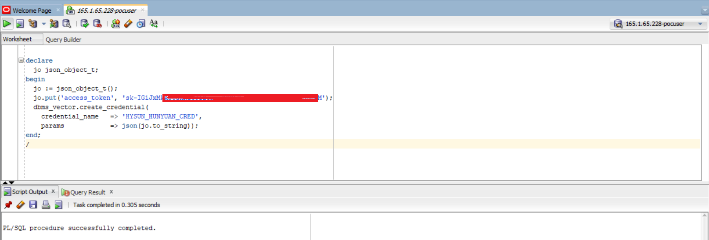
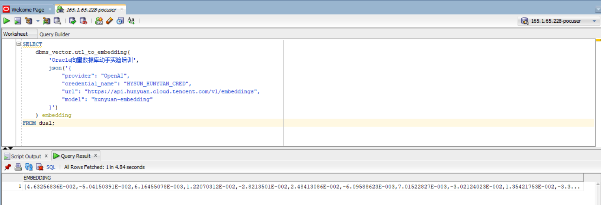

# Oracle向量数据库动手实验

- [Oracle向量数据库动手实验](#Oracle向量数据库动手实验)
  - [介绍](#介绍)
  - [前提条件](#前提条件)
  - [环境准备](#环境准备)
  - [实验1：Oracle向量基本操作](#实验1：Oracle向量基本操作)
  - [实验2：向量检索](#实验2：向量检索)
    - [向量精确检索](#向量精确检索)
    - [向量近似检索](#向量近似检索)
  - [实验3：向量嵌入模型部署（仅讲师操作）](#实验3：部署向量嵌入模型（仅讲师操作）)
  - [实验4：库外向量化操作](#实验4：库外向量化操作)
  - [实验5：库内向量化操作](#实验5：库内向量化操作)
    - [导入向量嵌入模型](#导入向量嵌入模型)
    - [库内向量化及检索](#库内向量化及检索)
  - [实验6：与第三方向量嵌入模型服务集成（演示）](#实验6：与第三方向量嵌入模型服务集成（演示）)
    - [开通第三方API服务](#开通第三方API服务)
    - [创建访问凭证](#创建访问凭证)
    - [直接在SQL中Embedding](#直接在SQL中Embedding)
  - [总结](#总结)

## 介绍

为方便拷贝粘贴，使用过程中也可以借助本文档的Markdown版本：
https://github.com/HysunHe/23ai_workshop_prep/blob/main/Oracle%E5%90%91%E9%87%8F%E6%95%B0%E6%8D%AE%E5%BA%93_lab1.md

本实验以熟悉Oracle向量数据库的一些实际操作为主要目的，主要内容包括 Oracle向量数据类型、向量模型、数据向量化（库外向量化与库内向量化两种方式）、向量索引（HNSW和IVF）、向量检索（非索引精确检索和索引近似检索）。

预计时间：**1.5小时**

**目标**

- 了解Oracle向量数据类型及基本操作
- 了解向量相似度检索，包括精确检索和近似检索
- 了解常用的向量索引类型
- 了解向量模型的部署以及Oracle数据库与外部向量模型的结合
- 了解向量模型的导入以及Oracle数据库的库内向量化操作
- 了解库外向量化及库内向量化的优劣现状及前景

## 前提条件

1. 本实验重点在于动手操作，非对向量数据库及Oracle向量数据库进行理论上的讲解，因此，需要参与者已经参加过Oracle向量数据库的介绍或有所了解。
2. 有基本的PL/SQL知识，能够看简单的PL/SQL示例代码，能够利用客户端（如sqlplus）等运行提供的PL/SQL示例代码。
3. 最好有基本的Python知识，能够看懂简单的Python示例代码（非必需）。

## 环境准备

本实验需要的环境，请参考《动手试验环境说明.pdf》中 “参与者”已分配的账号和密码。如user1/user1。

例如，连接SQL Developer：


## 实验1：Oracle向量基本操作

让我们从基本的向量操作开如：

### 字符串转换为向量

TO_VECTOR()用来将字符串类型的数字数组转换为向量类型。

```sql
SELECT TO_VECTOR( '[3,3]');
```

### 向量转换为字符串

FROM_VECTOR()用来将向量类型转换为字符串类型。

```sql
SELECT FROM_VECTOR( TO_VECTOR( '[3,3]') );
```

### 向量间距离计算

VECTOR_DISTANCE(v1, v2, 距离策略) 是向量检索的关键操作，用来比较两个向量的距离（相似度）。距离越大，说明相似度越小；反之，说明两个向量越相似。
Oracle支持的距离策略主要有：EUCLIDEAN, COSINE, DOT, HAMMING

### 利用欧氏距离(L2)策略计算两个向量之间的距离

```sql
SELECT VECTOR_DISTANCE( vector('[2,2]'), vector('[5,6]'), EUCLIDEAN ) as distance;
```

注：欧几里得距离是指连接这两点的线段的长度（二维空间中），上述 [2,2] 和 [5,6] 两点间的距离由勾股定理可直接算出为 5

### 利用余弦距离策略计算两个向量之间的距离

```sql
SELECT VECTOR_DISTANCE( vector('[2,2]'), vector('[5,5]'), COSINE) as distance;
```

注：余弦距离策略关注的是两个向量在方向上的一致性，上述 [2,2] 和 [5,5] 在方向上完全一致，因此，它们的距离为0，代表两个向量完全匹配。

### 向量类型字段及样例表

Oracle 23ai 引入了向量数据类型：VECTOR (dimentions, format)，该类型可指定两个参数，第一个是向量的维度，如 [2,2] 是一个二维向量；第二个是数据格式，如 FLOAT32。也可以不指定。

建立一个测试表 galaxies:

```sql
create table galaxies (
    id number, 
    name varchar2(50), 
    doc varchar2(500), 
    embedding VECTOR
);
```

### 样例数据

向 galaxies 表中插入如下样例数据：

```sql
insert into galaxies values (1, 'M31', 'Messier 31 is a barred spiral galaxy in the Andromeda constellation.', '[0,1,1,0,0]');
insert into galaxies values (2, 'M33', 'Messier 33 is a spiral galaxy in the Triangulum constellation.', '[0,0,1,0,0]');
insert into galaxies values (3, 'M58', 'Messier 58 is an intermediate barred spiral galaxy in the Virgo constellation.', '[1,1,1,0,0]');
insert into galaxies values (4, 'M63', 'Messier 63 is a spiral galaxy in the Canes Venatici constellation.', '[0,0,1,0,0]');
insert into galaxies values (5, 'M77', 'Messier 77 is a barred spiral galaxy in the Cetus constellation.', '[0,2,2,0,0]');
insert into galaxies values (6, 'M91', 'Messier 91 is a barred spiral galaxy in the Coma Berenices constellation.', '[0,3,3,0,0]');
insert into galaxies values (7, 'M49', 'Messier 49 is a giant elliptical galaxy in the Virgo constellation.', '[0,0,0,1,1]');
insert into galaxies values (8, 'M60', 'Messier 60 is an elliptical galaxy in the Virgo constellation.', '[0,0,0,0,1]');
insert into galaxies values (9, 'NGC1073', 'NGC 1073 is a barred spiral galaxy in Cetus constellation.', '[0,3,3,0,0]'); 
commit;
```

数据准备好后，接下来，我们就可以根所数据进行检索了。

## 实验2：向量检索

### 向量精确检索

向量精确检索（Exact Search）类似于关系数据查询时的全表扫描，是指库中的每一个向量都与查询向量进行匹配，这样就能计算出每个向量与查询向量之间的相似度，从而精确的返回与查询向量最相似的 N 条记录，不会漏掉任何一条记录（也就是说，召回率始终能达到 100%）.

由于结果的准确性，毫无疑问，在需要遍历的向量数据集较小时，精确检索是较优的方式。

在使用如Oracle这类融合数据库时，很多情况下，可以使用关系数据的业务属性字段（标量字段）缩小需要进行向量匹配的数据，因此，结合关系数据库特征，可以很大程序上提高向量检索的精确性和性能。

SQL 查询语句：利用余弦策略检索出与向量 [0,1,1,0,0] 最相近的3条记录：

```sql
SELECT *
FROM galaxies
ORDER BY VECTOR_DISTANCE( embedding, to_vector('[0,1,1,0,0]'), COSINE )
FETCH FIRST 3 ROWS ONLY;
```

查询结果：


查看执行计划：


### 向量近似检索

向量近似检索（Approximate Search）

精确检索获得了最高的准确率，但需要遍历所有向量数据集，因此，在向量数据集比较大时，性能很可能会成为问题。向量检索中，准确率和性能之间，往往需要寻找一个平衡。在大数据集上，为了提高性能，利用索引进行向量近似检索是常用的方式。

常见的向量索引有HNSW和IVF两种。

#### 向量内存池

要允许创建向量索引，必须在SGA中启用一块新的内存区域，称为向量内存池。向量内存池用于存储HNSW向量索引和所有相关元数据，以及用于加速IVF索引创建和维护。

向量内存池参数可以由管理员用户进行修改。



```sql
show parameter vector_memory_size;
```



向量内存池大小估算公式： size of vector pool = 1.3 * number of vectors * number of dimensions * size of vector dimension type

#### 向量内存池视图

V$VECTOR_MEMORY_POOL视图包含了向量内存的分配和使用情况。比如：

```sql
SELECT 
    CON_ID, 
    sum(alloc_bytes) / 1024 / 1024 as allocated_mb, 
    sum(USED_BYTES) / 1024 / 1024 as used_mb 
FROM V$VECTOR_MEMORY_POOL 
GROUP BY CON_ID;
```



#### 创建HNSW索引

创建索引语句：

```sql
CREATE VECTOR INDEX galaxies_hnsw_idx ON galaxies (embedding)
ORGANIZATION INMEMORY NEIGHBOR GRAPH
DISTANCE COSINE
WITH TARGET ACCURACY 90;
-- PARAMETERS (type HNSW, neighbors 32, efconstruction 200)
-- parallel 2;
```

创建 HNSW 索引时，我们可以指定目标准确率 target accuracy，并行执行；还可以指定 HNSW 的参数 M (即 neighbors) 和 efConstruction (如上面注释掉的 Parameters 一行)。关于 HNSW 相关参数的说明可以参考如下文档：
https://docs.oracle.com/en/database/oracle/oracle-database/23/vecse/oracle-ai-vector-search-users-guide.pdf (184页)
https://learn.microsoft.com/en-us/javascript/api/@azure/search-documents/hnswparameters?view=azure-node-latest

#### 查看索引信息 (需要权限，仅讲师展示)

字典表 VECSYS.VECTOR$INDEX 记录了创建的索引的详细信息：

```sql
SELECT idx_name, JSON_SERIALIZE(IDX_PARAMS returning varchar2 PRETTY) as index_info from VECSYS.VECTOR$INDEX;
```



#### HNSW 近似检索

查询SQL:

```sql
SELECT *
FROM galaxies
ORDER BY VECTOR_DISTANCE( embedding, to_vector('[0,1,1,0,0]'), COSINE )
FETCH APPROX FIRST 3 ROWS ONLY;
```

查询结果：


查看执行计划：


#### 创建IVF索引

如果之前已经在对应的列上创建了向量索引，那么先将其删除，如：

```sql
drop index galaxies_hnsw_idx;
```

创建IVF索引语句：

```sql
CREATE VECTOR INDEX galaxies_ivf_idx ON galaxies(embedding)
ORGANIZATION NEIGHBOR PARTITIONS
DISTANCE COSINE
WITH TARGET ACCURACY 90;
-- PARAMETERS (type IVF, neighbor partitions 32)
-- parallel 2;
```

创建 IVF 索引时，我们可以指定目标准确率 target accuracy、并行执行参数，还可以指定 partition 数量等参数。关于 IVF 参数的说明，可以参考如下文档：
https://docs.oracle.com/en/database/oracle/oracle-database/23/vecse/oracle-ai-vector-search-users-guide.pdf (196页)

#### IVF 近似检索

创建了IVF索引之后，我们利用索引进行近似检索（注：由于我们的实验用的数据集很小，所以优化器很可能不会选择走IVF索引）

```sql
SELECT /*+ VECTOR_INDEX_TRANSFORM(galaxies galaxies_ivf_idx) */ *
FROM galaxies
ORDER BY VECTOR_DISTANCE( embedding, to_vector('[0,1,1,0,0]'), COSINE )
FETCH APPROX FIRST 3 ROWS ONLY;
```

查询结果：


查看执行计划：



## 实验3：部署向量嵌入模型（仅讲师操作）

**此节内容仅讲师动手操作及讲解。**

以上我们介绍了向量的基本操作。在上面的例子中，我们的向量数据是手工造的，向量的维度也很小。那么，在现实环境中，向量数据是如何来的？答案是向量嵌入模型。

在本实验中，我们将使用开源的向量嵌入模型 text2vec-large-chinese

### 向量嵌入模型部署

考虑到硬件资源因素，没有足够的资源让每个人都部署一份模型，因此，本操作仅由讲师完成。讲师将向量嵌入模型部分为REST API 的方式，供大家调用；同时展示源代码并讲解。

源代码：https://github.com/HysunHe/23ai_workshop_prep

```shell
# 创建Python环境
conda create -n ws23ai python=3.12

# 进入新创建的Python环境
conda activate ws23ai

# 安装依赖
pip install -r requirements.txt

# 下载源码
git clone https://github.com/HysunHe/23ai_workshop_prep

# 启动模型
cd 23ai_workshop_prep

nohup python -u main.py > lab.out 2>&1 &
```

### 向量嵌入模型访问

向量嵌入模型部署完成后，就可以根据提供的REST API进行访问了。提供了如下两个API：

1. 文本向量化API（后续将用到）

   ```shell
    curl -X 'POST' \
    'http://<ip>:<port>/workshop/embedding' \
    -H 'accept: application/json' \
    -H 'Content-Type: application/json' \
    -d '{
        "text": "<需要向量化的文本>"
    }'
   ```
2. 批量数据准备API（后续将用到）

   ```shell
   curl -X 'POST' \
    'http://<ip>:<port>/workshop/prepare-data' \
    -H 'accept: application/json' \
    -H 'Content-Type: application/json' \
    -d '{
        "db_user": "<数据库用户名>",
        "db_password": "<数据库用户密码>",
        "table_name": "<表名>",
        "dataset_name": "<数据集名称>"
    }'
   ```

## 实验4：库外向量化操作

### 数据加载

库外向量化指源数据由外部程序向量化之后，再插入或加载到数据库表中。在本例中，我们将使用 Python 程序将文本数据向量化之后，再调用Oracle客户包将数据插入到数据库中。这是常用的一种方法，操作方式也与平时的数据加载操作一致。

为了让接下来的实验更接近真实场景，我们将创建另一张表 lab_vecstore：

```sql
CREATE TABLE lab_vecstore (
    id VARCHAR2(50) DEFAULT SYS_GUID() PRIMARY KEY,
    dataset_name VARCHAR2(50) NOT NULL,
    document CLOB,
    cmetadata JSON,
    embedding VECTOR(*, FLOAT32)
);
```

这里我们没有指定向量的维度，但指定了数据类型格式是 FLOAT32，与向量模型的输出一致。下面我们将源数据文件（源数据集）加载进lab_vecstore表。

源数据集：讲师展示源数据集。

接下来，请调用 批量数据准备API（API 会将上述源数据集进行向量化之后，再插入到数据库中）：

```shell
curl -X 'POST' \
    'http://<ODA数据库IP>:8099/workshop/prepare-data' \
    -H 'accept: application/json' \
    -H 'Content-Type: application/json' \
    -d '{
        "db_user": "<userx>",
        "db_password": "<password>",
        "table_name": "lab_vecstore",
        "dataset_name": "oracledb_docs"
    }'
```

注：如果没安装curl等api调用工具，也可以通过如下界面的方式执行：

1. 打开链接http://<ODA数据库IP>:8099/workshop/docs#/default/prepare_data_workshop_prepare_data_post
2. 点击 "Try it out" 按钮
3. 在 "Request body" 输入框中，输入分配给你的 db_user 和 db_password 参数
4. 点击 "Execute" 按钮执行。


API 执行完成后，可以查看一下表中的数据：

```sql
-- 本数据集总共有231条记录
select count(*) from lab_vecstore;  

-- 查看数据
select t.cmetadata.source as src_file, embedding as embedding 
from lab_vecstore t;
```


至此，源数据集已经向量化完成，并且成功入库了。（讲师展示并讲解外部向量化的源代码）

### 向量检索

本实验中，我们使用 “Oracle 23ai 新特性” 这个文本进行相似度检索。

第一步，先将要检索的文本在库外向量化。我们调用上述提供的API完成这一步。API将返回向量数据。

```sql
-- 第一步：向量化用户问题
select apex_web_service.make_rest_request(
    p_url => 'http://146.235.226.110:8099/workshop/embedding',
    p_http_method => 'POST',
    p_body => '{ "text": "Oracle 23ai 新特性" }'
);
```


第二步，执行 SQL 语句检索相似的数据，将上一步中返回的向量传入到VECTOR_DISTANCE函数中：

```sql
set serveroutput on;

declare
    l_question varchar2(500) := 'Oracle 23ai 新特性';
    l_input CLOB;
    l_clob  CLOB;
    j apex_json.t_values;
    l_embedding CLOB;
begin
    apex_web_service.g_request_headers(1).name :=  'Content-Type';
    apex_web_service.g_request_headers(1).value := 'application/json';
    l_input := '{"text": "' || l_question || '"}';
  
    -- 第一步：向量化用户问题
    l_clob := apex_web_service.make_rest_request(
        p_url => 'http://146.235.226.110:8099/workshop/embedding',
        p_http_method => 'POST',
        p_body => l_input
    );
    apex_json.parse(j, l_clob);   
    l_embedding := apex_json.get_varchar2(p_path => 'data.embedding', p_values => j);
    -- dbms_output.put_line('*** embedding: ' || l_embedding);
  
    -- 第二步：执行 SQL 语句检索相似的数据，将上一步中返回的向量传入到VECTOR_DISTANCE函数中，从向量数据库中检索出与问题相似的内容
    for rec in (
        select document, json_value(cmetadata, '$.source') as src_file
        from lab_vecstore
        where dataset_name='oracledb_docs'
        order by VECTOR_DISTANCE(embedding, to_vector(l_embedding))
        FETCH FIRST 3 ROWS ONLY
    ) loop
        DBMS_OUTPUT.put_line(chr(10) || '####################################');
        DBMS_OUTPUT.put_line(rec.document || ' | ' || rec.src_file);
        DBMS_OUTPUT.put_line('####################################' || chr(10));
    end loop;
end;
/
```


## 实验5：库内向量化操作

Oracle 数据库提供了库内向量化的特性，其允许用户导入向量嵌入模型到数据库中，然后可以直接在SQL中对数据进行向量化操作，无需依赖外部的程序，这种方式很大程序的简化了向量数据的加载和检索，非常方便。

### 导入向量嵌入模型

考虑到硬件资源因素，没有足够的资源让每个人都加载一份模型，因此，本操作仅由讲师完成。讲师展示加载操作，并提供讲解。

需要加载进Oracle数据库的向量嵌入模型必须为标准的ONNX格式，且大小在1G之内。

```sql

-- 先将模型文件 bge-base-zh-v1.5.onnx 上传到/u01/hysun/models目录
-- 创建数据库目录指向模型文件所在目录
create or replace directory MODELS_DIR as '/u01/hysun/models';

-- 导入模型
-- 先删除已经存在的模型（如果存在）： 
EXEC DBMS_VECTOR.DROP_ONNX_MODEL(model_name => 'mydoc_model', force => true);

-- 导入模型
BEGIN
    DBMS_VECTOR.LOAD_ONNX_MODEL(
        directory => 'MODELS_DIR',
        file_name => 'bge-base-zh-v1.5.onnx',
        model_name => 'mydoc_model'
    );
END;
/

```



模型导入后，可以查看模型的属性：

```sql
SELECT MODEL_NAME, MINING_FUNCTION, ALGORITHM, ALGORITHM_TYPE, MODEL_SIZE
FROM USER_MINING_MODELS;

SELECT MODEL_NAME, ATTRIBUTE_NAME, ATTRIBUTE_TYPE, DATA_TYPE,VECTOR_INFO
FROM USER_MINING_MODEL_ATTRIBUTES
WHERE MODEL_NAME = 'MYDOC_MODEL';
```


可以测试一下导入的模型是否如期工作：

```sql
SELECT VECTOR_EMBEDDING(mydoc_model USING 'Hello, World' as data) AS embedding;
```


### 库内向量化及检索

#### 准备数据

为了排除干扰，我们新建同样的一张表 lab_vecstore2：

```sql
CREATE TABLE lab_vecstore2 (
    id VARCHAR2(50) DEFAULT SYS_GUID() PRIMARY KEY,
    dataset_name VARCHAR2(50) NOT NULL,
    document CLOB,
    cmetadata JSON,
    embedding VECTOR(*, FLOAT32)
);
```

然后从原来的表中拷贝几条数据（作为实验，建议不要拷贝太多数据，以避免造成资源紧张）：

```sql
insert into lab_vecstore2(dataset_name, document, cmetadata)
select dataset_name, document, cmetadata 
from lab_vecstore  --
where json_value(cmetadata, '$.source') like '%202408_23ai%';
commit;

select * from lab_vecstore2;
```



#### 库内向量化

```sql
-- 向量化之前，先查看一下表中的数据，此时 EMBEDDING 字段是空
select * from lab_vecstore2;

-- 执行SQL完成向量化
update lab_vecstore2 set embedding=VECTOR_EMBEDDING(mydoc_model USING document as data);
commit;

-- 向量化之后，再次查看一下表中的数据，此时 EMBEDDING 字段是已经有值了。
select * from lab_vecstore2;
```


上述操作我们直接用标准的 SQL update 语句对表中的源数据进行了向量化。

#### 相似度检索

由于我们已经在数据库中导入了向量嵌入模型，这里我们可以直接把文本传入 VECTOR_EMBEDDING，进行相似度检索了。

```sql
select document,
  json_value(cmetadata, '$.source') as src_file
from lab_vecstore2
where dataset_name='oracledb_docs'
order by VECTOR_DISTANCE(embedding, VECTOR_EMBEDDING(mydoc_model USING 'Oracle 23ai 新特性' as data), COSINE)
FETCH APPROX FIRST 3 ROWS ONLY;
```


## 实验6：与第三方向量嵌入模型服务集成（演示）

Oracle数据库向量化操作能支持众多外部提供商提供的API，包括：

* OCIGenAI (Oracle OCI)
* OpenAI
* Cohere
* HuggingFace
* GoogleAI
* VertexAI
* 以及所有能兼容 OpenAI API 规范的其它服务接口。

本节以腾讯混元Embeddings模型为例，演示如何在Oracle中直接用简单的SQL调用腾讯混元Embedding模型，实现数据的向量化。对于其它的API提供商，做法上是一样的。

### 开通第三方API服务

首先，开通腾讯混元大模型服务，并注册API Key： https://console.cloud.tencent.com/hunyuan/api-key 。

### 创建访问凭证

利用刚才创建的API Key，在Oracle数据库中创建访问凭证。

```sql
declare
  jo json_object_t;
begin
  jo := json_object_t();
  jo.put('access_token', 'sk-IGiJxMkAxxxxxxxxxxxxxxxxxxxxxxxxxxxxxxxxxxxx');
  dbms_vector.create_credential(
    credential_name   => 'HYSUN_HUNYUAN_CRED',
    params            => json(jo.to_string));
end;
/
```



### 直接在SQL中Embedding

在SQL中直接调用dbms_vector.utl_to_embedding或dbms_vector.utl_to_embeddings将数据转化为向量：

首先，如果当前用户访问API的URL地址不被允许(ACL错误)，则先创建ACE:

```sql
BEGIN
    DBMS_NETWORK_ACL_ADMIN.APPEND_HOST_ACE(
        host => 'api.hunyuan.cloud.tencent.com',
        lower_port => 443,
        upper_port => 443,
        ace  => xs$ace_type(privilege_list => xs$name_list('http'),
                             principal_name => '<数据库用户名>',
                             principal_type => xs_acl.ptype_db)
   );
END;
/
```

调用混元 API Embedding 服务:

```sql
SELECT
    dbms_vector.utl_to_embedding(
        'Oracle向量数据库动手实验培训',
        json('{
            "provider": "OpenAI",
            "credential_name": "HYSUN_HUNYUAN_CRED",
            "url": "https://api.hunyuan.cloud.tencent.com/v1/embeddings",
            "model": "hunyuan-embedding"
        }')
    ) embedding
FROM dual;
```



## 总结

至此，我们已经完成了Oracle向量数据库的动手实验第一部分。

本节内容中，我们实现了利用向量检索的精确检索和近似检索两种方式。现实中，在相对较大的数据集中，精确检索往往只有在融合数据库中才能发挥出真正的优势。比如，在我们的实验中，我们使用标量字段dataset_name='oracledb_docs'将需要进行向量检索的数据集大幅度缩小了，有效弥补了精确检索的性能问题。

同时，我们还实现了Oracle库外向量化和库内向量化两种方式。库内向量化因其简单便捷的特点，有可能成为未来向量化的一个重要方向。然而，就目前而言，局限于数据库硬件资源现状，往往库外向量化方式使用更多。

最后，我们还介绍了如何通过与第三方Embedding API服务集成，在SQL中调用第三方服务完成向量化的过程。

下一节我们将进行第二部分的实验：结合Oracle向量检索的RAG应用。
