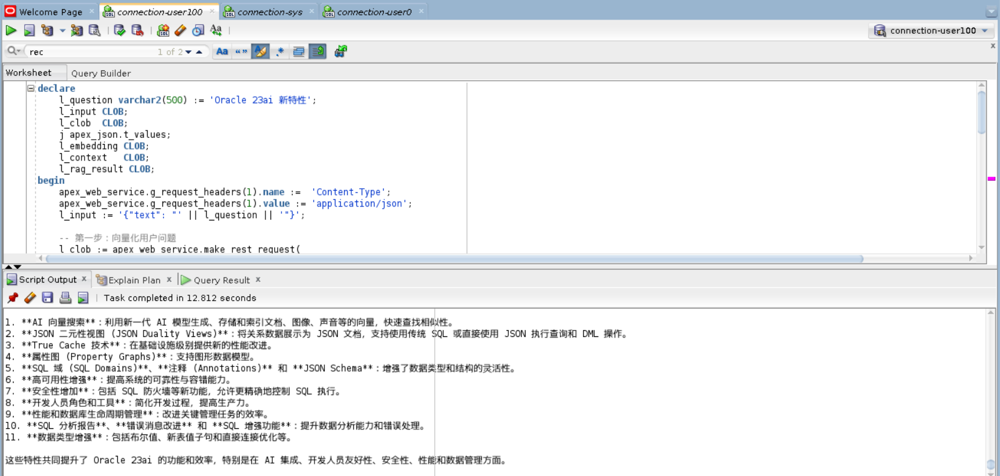
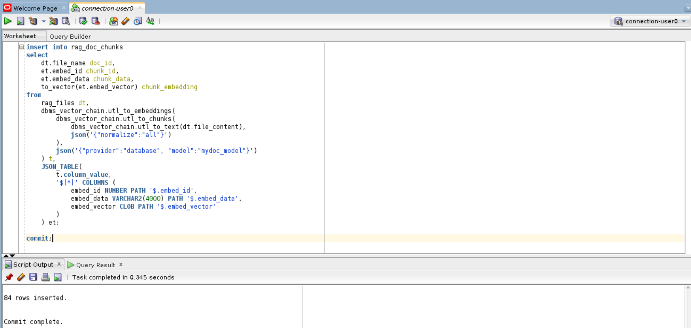
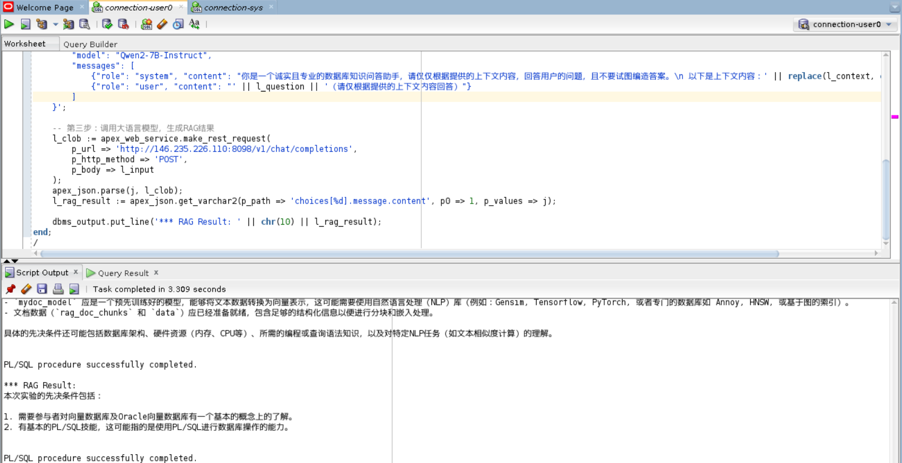

# Oracle向量数据库与RAG应用

- [Oracle向量数据库与RAG应用](#Oracle向量数据库与RAG应用)
  - [介绍](#介绍)
  - [前提条件](#前提条件)
  - [环境准备](#环境准备)
  - [实验1：大语言模型部署（仅讲师操作）](#实验1：大语言模型部署（仅讲师操作）)
    - [下载模型](#下载模型)
    - [用vLLM部署模型](#用vLLM部署模型)
    - [测试部署](#测试部署)
  - [实验2：直接与LLM对话（非RAG）](#实验2：直接与LLM对话（非RAG）)
  - [实验3：RAG方式与LLM对话](#实验3：RAG方式与LLM对话)
  - [比较实验2和实验3的结果，理解导致差异的原因](#比较实验2和实验3的结果，理解导致差异的原因)
  - [实验4：Oracle库内向量化流水线操作](#实验4：Oracle库内向量化流水线操作)
    - [准备数据表](#准备数据表)
    - [加载文件](#加载文件)
    - [执行【文件转换--&gt;文档拆分--&gt;向量化】流水线](#执行【文件转换-->文档拆分-->向量化】流水线)
    - [向量相似度检索](#向量相似度检索)
    - [RAG](#结合向量相似度检索做RAG)
  - [总结](#总结)

## 介绍

为方便拷贝粘贴，使用过程中也可以借助本文档的Markdown版本：
https://github.com/HysunHe/23ai_workshop_prep/blob/main/Oracle%E5%90%91%E9%87%8F%E6%95%B0%E6%8D%AE%E5%BA%93_lab2.md

本实验是Oracle向量数据库动手实验的第二部分内容。

本节将实验向量数据库的一个典型应用场景：RAG。在RAG的解决方案中，组件要素主要包括：大语言模型（LLM）、向量嵌入模型（embedding model）、向量数据库 以及 Rerank模型（非必要，根据实际情况可选，本实验不涉及Rerank模型）。

预计时间：**1小时**

**目标**

- 了解大语言模型(LLM)部署
- 了解RAG的作用
- 了解利用Oracle向量检索与LLM结合实现RAG的基本步骤
- 了解Oracle库内向量化流水线操作的主要函数
- 利用向量化流水线操作的结果数据，再次实现RAG，进一步熟悉RAG的实现

## 前提条件

参与者已经熟悉Oracle数据库向量检索的基本操作，最好是已经参加了Oracle向量数据库动手实验的第一部分内容。


## 环境准备

本实验需要的环境，请参考《动手试验环境说明.pdf》中 “参与者”已分配的账号和密码。如user1/user1。

例如，连接SQL Developer：


## 实验1：大语言模型部署（仅讲师操作）

**此节内容仅讲师动手操作及讲解。**

大语言模型是生成式AI的关键部分。本实验中，我们将选用开源的通义千问模型：Qwen2-7B-Instruct

考虑到硬件资源因素，本操作仅由讲师完成。

模型部署将部署到以下 GPU (A10) 机器上：

机器IP: 146.235.226.110

备用机器IP：150.230.37.250 (人数较多主机器服务不过来时使用)

### 下载模型

从魔搭社区 (modelscope) 下载：[Qwen2-7B-Instruct](https://www.modelscope.cn/models/qwen/Qwen2-7B-Instruct)

### 用vLLM部署模型

在GPU机器上可以采用vLLM来部署模型。vLLM是一个模型加速库，能大幅提升推理效率及并发。

安装Python环境及vLLM工具：

```shell
# 创建Python环境
conda create -n vllm python=3.12

# 进入新创建的环境
conda activate vllm

# 安装vllm依赖包
pip install vllm
```

启动运行：

```shell
 nohup python -u -m vllm.entrypoints.openai.api_server --port 8098 --model /home/ubuntu/ChatGPT/Models/Qwen/Qwen2-7B-Instruct  --served-model-name Qwen2-7B-Instruct --device=cuda --dtype auto --max-model-len=2048 > vllm.out 2>&1 &
```

### 测试部署

```shell
curl http://146.235.226.110:8098/v1/chat/completions \
    -H "Content-Type: application/json" \
    -d '{
        "model": "Qwen2-7B-Instruct",
        "messages": [
            {"role": "system", "content": "You are a helpful assistant."},
            {"role": "user", "content": "Tell me something about large language models."}
        ]
    }'
```

## 实验2：直接与LLM对话（非RAG）

先运行如下语句，打开输出信息，这样dbms_output就能在脚本输出窗口中输出打印信息了。

```sql
SET SERVEROUTPUT ON;
```

以下PL/SQL代码是直接调用LLM API的过程，也可以用其它语言实现，步骤或逻辑都一样。

```sql
declare
    l_question varchar2(500) := 'Oracle 23ai 新特性';
    l_input CLOB;
    l_clob  CLOB;
    j apex_json.t_values;
    l_embedding CLOB;
    l_context   CLOB;
    l_rag_result CLOB;
begin
    apex_web_service.g_request_headers(1).name :=  'Content-Type';
    apex_web_service.g_request_headers(1).value := 'application/json';
    l_input := '{"text": "' || l_question || '"}';
  
    -- 第一步：提示工程：给大语言模型明确的指示
    l_input := '{
        "model": "Qwen2-7B-Instruct",
        "messages": [
            {"role": "system", "content": "你是一个诚实且专业的数据库知识问答助手，请回答用户提出的问题。"},
            {"role": "user", "content": "' || l_question || '"}
        ]
    }';
  
    -- 第二步：调用大语言模型，生成RAG结果
    l_clob := apex_web_service.make_rest_request(
        p_url => 'http://146.235.226.110:8098/v1/chat/completions',
        p_http_method => 'POST',
        p_body => l_input
    );
    apex_json.parse(j, l_clob); 
    l_rag_result := apex_json.get_varchar2(p_path => 'choices[%d].message.content', p0 => 1, p_values => j);
  
    dbms_output.put_line('*** Result: ' || chr(10) || l_rag_result);
end;
/
```

运行结果：


## 实验3：RAG方式与LLM对话

先运行如下语句，打开输出信息，这样dbms_output就能在脚本输出窗口中输出打印信息了。

```sql
SET SERVEROUTPUT ON;
```

以下PL/SQL代码是执行 RAG 的过程，也可以用其它语言实现，步骤或逻辑都一样。

```sql
declare
    l_question varchar2(500) := 'Oracle 23ai 新特性';
    l_input CLOB;
    l_clob  CLOB;
    j apex_json.t_values;
    l_embedding CLOB;
    l_context   CLOB;
    l_rag_result CLOB;
begin
    apex_web_service.g_request_headers(1).name :=  'Content-Type';
    apex_web_service.g_request_headers(1).value := 'application/json';
    l_input := '{"text": "' || l_question || '"}';
  
    -- 第一步：向量化用户问题
    l_clob := apex_web_service.make_rest_request(
        p_url => 'http://146.235.226.110:8099/workshop/embedding',
        p_http_method => 'POST',
        p_body => l_input
    );
    apex_json.parse(j, l_clob);   
    l_embedding := apex_json.get_varchar2(p_path => 'data.embedding', p_values => j);
    -- dbms_output.put_line('*** embedding: ' || l_embedding);
  
    -- 第二步：从向量数据库中检索出与问题相似的内容
    for rec in (select document, json_value(cmetadata, '$.source') as src_file
        from lab_vecstore
        where dataset_name='oracledb_docs'
        order by VECTOR_DISTANCE(embedding, to_vector(l_embedding))
        FETCH FIRST 3 ROWS ONLY) loop
        l_context := l_context || rec.document || chr(10);
    end loop;
  
    -- 第三步：提示工程：将相似内容和用户问题一起，组成大语言模型的输入
    l_context := replace(replace(replace(l_context, '''', ''), '"', '\"'), chr(10), '\n');
    l_input := '{
        "model": "Qwen2-7B-Instruct",
        "messages": [
            {"role": "system", "content": "你是一个诚实且专业的数据库知识问答助手，请根据提供的上下文内容，回答用户的问题。\n 以下是上下文内容：' || l_context || '"},
            {"role": "user", "content": "' || l_question || '（请仅根据提供的上下文内容回答，不要试图编造答案）"}
        ]
    }';
  
    -- 第四步：调用大语言模型，生成RAG结果
    l_clob := apex_web_service.make_rest_request(
        p_url => 'http://146.235.226.110:8098/v1/chat/completions',
        p_http_method => 'POST',
        p_body => l_input
    );
    apex_json.parse(j, l_clob); 
    l_rag_result := apex_json.get_varchar2(p_path => 'choices[%d].message.content', p0 => 1, p_values => j);
  
    dbms_output.put_line('*** RAG Result: ' || chr(10) || l_rag_result);
end;
/
```

运行结果：



## 比较实验2和实验3的结果，理解导致差异的原因

请观察和思考实验2和实验3的结果，理解导致二者结果差异的关键因素。

## 实验4：Oracle库内向量化流水线操作

Oracle数据库提供一系列工具，让用户可以用极简单的方式将源数据向量化并加载到数据库中。

本节主要目的在于：了解在Oracle库内实现一个完整的从源文件到生成向量数据 这样一个库内流水线操作：PDF文件 --> 文件文件 --> 文件分块 --> 生成向量数据。


Oracle 数据库提供了一系列的工具方法，以方便向量的操作。这些方法主要封装在 DBMS_VECTOR / DBMS_VECTOR_CHAIN 这两个包中，可以直接调用。例如：

* dbms_vector_chain.utl_to_text：将文件转换为文本格式，如PDF格式转换为文本格式。
* dbms_vector_chain.utl_to_chunks: 将文档以块的形式拆分成多个块
* dbms_vector_chain.utl_to_embeddings：将文档块进行向量化（批量形式）。
* dbms_vector_chain.utl_to_generate_text：调用大语言模型，生成RAG结果。

对于【PDF文件 --> 文件文件 --> 文件分块 --> 向量化】这样一个复杂的过程，利用上面这些工具方法，在Oracle数据库中仅通过一条SQL语句即可实现。下面我们展示一下这个过程：

### 准备数据表

```sql
-- 用来加载存储源文件
create table RAG_FILES (
    file_name varchar2(500), 
    file_content BLOB
);

-- 用来存储文件块以及对象的向量
CREATE TABLE RAG_DOC_CHUNKS (
    "DOC_ID" VARCHAR2(500), 
	"CHUNK_ID" NUMBER, 
	"CHUNK_DATA" VARCHAR2(4000), 
	"CHUNK_EMBEDDING" VECTOR
);


```

### 加载文件

加载文件有多种方式，比如从对象存储中加载、从文件服务器加载等等。为简单起见，本实验中预先将一个PDF文件上传到数据库服务器上，从本地目录加载文件。

```sql
-- 首先，将文件手工上传至 /u01/hysun/rag_docs 目录
-- 本实验中已经预先上传了一个PDF文件（内容就是本实验的PDF指导文件)

-- 然后再创建数据库目录，如下
create or replace directory RAG_DOC_DIR as '/u01/hysun/rag_docs';

-- 从数据目录下加载源文件入库
insert into RAG_FILES(file_name, file_content) values('oracle-vector-lab', to_blob(bfilename('RAG_DOC_DIR', 'Oracle向量数据库_lab.pdf')));
commit;

```


### 执行【文件转换-->文档拆分-->向量化】流水线

以下用一条SQL完成了【PDF格式 -> 文本格式 -> 文档分块 -> 向量化】这样一个比较复杂的流程：

```sql
insert into rag_doc_chunks
select 
    dt.file_name doc_id, 
    et.embed_id chunk_id, 
    et.embed_data chunk_data, 
    to_vector(et.embed_vector) chunk_embedding
from
    rag_files dt,
    dbms_vector_chain.utl_to_embeddings(
        dbms_vector_chain.utl_to_chunks(
            dbms_vector_chain.utl_to_text(dt.file_content),
            json('{"normalize":"all"}')
        ),
        json('{"provider":"database", "model":"mydoc_model"}')
    ) t,
    JSON_TABLE(
        t.column_value, 
        '$[*]' COLUMNS (
            embed_id NUMBER PATH '$.embed_id', 
            embed_data VARCHAR2(4000) PATH '$.embed_data', 
            embed_vector CLOB PATH '$.embed_vector'
        )
    ) et;
commit;
```



### 向量相似度检索

源数据完成向量化后，就可以利用 VECTOR_DISTANCE 进行向量相似度检索了。

```sql
select *
from rag_doc_chunks
order by VECTOR_DISTANCE(chunk_embedding, VECTOR_EMBEDDING(mydoc_model USING '本次实验的先决条件' as data), COSINE)
FETCH FIRST 3 ROWS ONLY;
```


### RAG

```sql
set serveroutput on;

declare
    l_question varchar2(500) := '完成本次实验的前提条件需要哪些';
    l_input CLOB;
    l_clob  CLOB;
    j apex_json.t_values;
    l_context   CLOB;
    l_rag_result CLOB;
begin
    -- 第一步：从向量数据库中检索出与问题相似的内容
    for rec in (
        select
        chunk_data
        from rag_doc_chunks
        order by VECTOR_DISTANCE(chunk_embedding, VECTOR_EMBEDDING(mydoc_model USING l_question as data), COSINE)
        FETCH FIRST 3 ROWS ONLY
    ) loop
        l_context := l_context || rec.chunk_data || chr(10);
    end loop;

    -- 第二步：提示工程：将相似内容和用户问题一起，组成大语言模型的输入
    l_context := replace(replace(replace(l_context, '''', ''), '"', '\"'), chr(10), '\n');
    l_input := '{
        "model": "Qwen2-7B-Instruct",
        "messages": [
            {"role": "system", "content": "你是一个诚实且专业的数据库知识问答助手，请根据提供的上下文内容，回答用户的问题。\n 以下是上下文内容：' || l_context || '"},
            {"role": "user", "content": "' || l_question || '（请仅根据提供的上下文内容回答，不要试图编造答案）"}
        ]
    }';
  
    -- 第三步：调用大语言模型，生成RAG结果
    l_clob := apex_web_service.make_rest_request(
        p_url => 'http://146.235.226.110:8098/v1/chat/completions',
        p_http_method => 'POST',
        p_body => l_input
    );
    apex_json.parse(j, l_clob); 
    l_rag_result := apex_json.get_varchar2(p_path => 'choices[%d].message.content', p0 => 1, p_values => j);

    dbms_output.put_line('*** RAG Result: ' || chr(10) || l_rag_result);
end;
/
```



## 总结

至此，我们已经完成了Oracle向量数据库的动手实验第二部分。在本节中，我们重点实现了结合Oracle向量检索的RAG应用。本节中，我们RAG的实现用的是PL/SQL，实际上它是不局限于用哪种编程语言的，比如 Python、Java、Go 等等都可以。

本实验的重点在于了解如何利用Oracle向量检索实现RAG应用的原理和方法。对于RAG应用，能否生成高质量的回答，除了大语言模型本身的能力外，还取决于高质量的输入文档和文档拆分技术或方式、构建相对合理的提示词（提示工程）、等等其它诸多方面，需要结合实际情况综合考虑。
