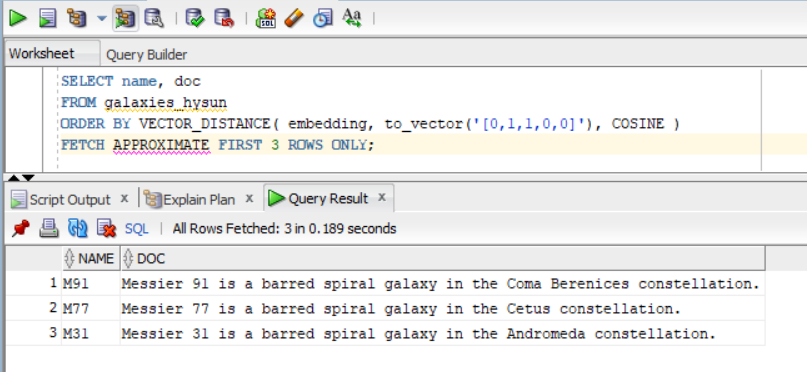
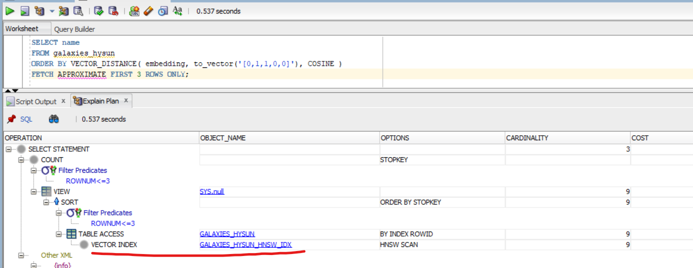
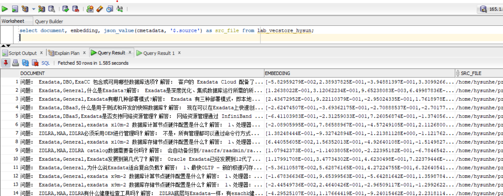

# Oracle向量数据库动手实验

本实验以熟悉Oracle向量数据库的一些实际操作为主要目的，主要内容包括 Oracle向量数据类型、向量模型、数据向量化（库外向量化与库内向量化两种方式）、向量索引（HNSW和IVF）、向量检索（非索引精确检索和索引近似检索）、RAG。

## 前提条件

1. 本实验重点在于动手操作，非对向量数据库及Oracle向量数据库进行理论上的讲解，因此，需要参与者对向量数据库及Oracle向量数据库有一个基本的概念上的了解。
2. 有基本的PL/SQL知识，能够看简单的PL/SQL示例代码，能够利用客户端（如SQL Developer）等运行提供的PL/SQL示例代码。
3. 有基本的Python知识，能够看懂简单的Python示例代码。

## 环境准备

1. Oracle 23ai 数据库
2. Oracle SQL Developer 23+
3. API 调用工具，比如 curl、postman 等等都可以。

## 初识Oracle的向量操作

VECTOR_DISTANCE(v1, v2, 距离策略) 是向量检索的关键操作，用来比较两个向量的距离（相似度）。距离越大，说明相似度越小；反之，说明两个向量越相似。

Oracle支持的距离策略主要有：EUCLIDEAN, COSINE, DOT, HAMMING

### 利用欧氏距离(L2)策略计算两个向量之间的距离

```sql
SELECT VECTOR_DISTANCE( vector('[2,2]'), vector('[5,6]'), EUCLIDEAN ) as distance;
```

注：欧几里得距离是指连接这两点的线段的长度（二维空间中），上述 [2,2] 和 [5,6] 两点间的距离由勾股定理可直接算出为 5

### 利用余弦距离策略计算两个向量之间的距离

```sql
SELECT VECTOR_DISTANCE( vector('[2,2]'), vector('[5,5]'), COSINE) as distance;
```

注：余弦距离策略关注的是两个向量在方向上的一致性，上述 [2,2] 和 [5,5] 在方向上完全一致，因此，它们的距离为0，代表两个向量完全匹配。

## Oracle向量数据库基本操作

### 建表

Oracle 23ai 引入了向量数据类型：VECTOR (dimentions, format)，该类型可指定两个参数，第一个是向量的维度，如 [2,2] 是一个二维向量；第二个是数据格式，如 FLOAT32。也可以不指定。

建立一个测试表 galaxies（为避免多人实验冲突，建议表名中加入自己的名字）:

```sql
create table galaxies_hysun (
    id number, 
    name varchar2(50), 
    doc varchar2(500), 
    embedding VECTOR
);
```

### 插入样例数据（请注意用自己的表名）

```sql
insert into galaxies_hysun values (1, 'M31', 'Messier 31 is a barred spiral galaxy in the Andromeda constellation.', '[0,2,2,0,0]');
insert into galaxies_hysun values (2, 'M33', 'Messier 33 is a spiral galaxy in the Triangulum constellation.', '[0,0,1,0,0]');
insert into galaxies_hysun values (3, 'M58', 'Messier 58 is an intermediate barred spiral galaxy in the Virgo constellation.', '[1,1,1,0,0]');
insert into galaxies_hysun values (4, 'M63', 'Messier 63 is a spiral galaxy in the Canes Venatici constellation.', '[0,0,1,0,0]');
insert into galaxies_hysun values (5, 'M77', 'Messier 77 is a barred spiral galaxy in the Cetus constellation.', '[0,1,1,0,0]');
insert into galaxies_hysun values (6, 'M91', 'Messier 91 is a barred spiral galaxy in the Coma Berenices constellation.', '[0,1,1,0,0]');
insert into galaxies_hysun values (7, 'M49', 'Messier 49 is a giant elliptical galaxy in the Virgo constellation.', '[0,0,0,1,1]');
insert into galaxies_hysun values (8, 'M60', 'Messier 60 is an elliptical galaxy in the Virgo constellation.', '[0,0,0,0,1]');
insert into galaxies_hysun values (9, 'NGC1073', 'NGC 1073 is a barred spiral galaxy in Cetus constellation.', '[0,1,1,0,0]'); 
commit;
```

### 执行向量精确检索（Exact Search）

向量精确检索类似于关系数据查询时的全表扫描，是指库中的每一个向量都与查询向量进行匹配，这样就能计算出每个向量与查询向量之间的相似度，从而精确的返回与查询向量最相似的 N 条记录，不会漏掉任何一条记录（也就是说，召回率始终能达到 100%）.

由于结果的准确性，毫无疑问，在需要遍历的向量数据集较小时，精确检索是较优的方式。

在使用如Oracle这类融合数据库时，很多情况下，可以使用关系数据的业务属性字段（标量字段）缩小需要进行向量匹配的数据，因此，结合关系数据库特征，可以很大程序上提高向量检索的精确性和性能。

SQL 查询语句：利用余弦策略检索出与向量 [0,1,1,0,0] 最相近的3条记录（请注意用自己的表名）：

```sql
SELECT name
FROM galaxies_hysun
ORDER BY VECTOR_DISTANCE( embedding, to_vector('[0,1,1,0,0]'), COSINE )
FETCH FIRST 3 ROWS ONLY;
```

### 执行向量近似检索（Approximate Search）

精确检索获得了最高的准确率，但需要遍历所有向量数据集，因此，在向量数据集比较大时，性能很可能会成为问题。向量检索中，准确率和性能之间，往往需要寻找一个平衡。在大数据集上，为了提高性能，利用索引进行向量近似检索是常用的方式。

常见的向量索引有HNSW和IVF两种。

### 创建HNSW索引

创建IV索引语句（请注意用自己的表名和索引名）：

```sql
CREATE VECTOR INDEX galaxies_hysun_hnsw_idx ON galaxies_hysun (embedding)
ORGANIZATION INMEMORY NEIGHBOR GRAPH
DISTANCE COSINE
WITH TARGET ACCURACY 90
-- PARAMETERS (type HNSW, neighbors 32, efconstruction 200)
parallel 2;
```

创建 HNSW 索引时，我们可以指定目标准确率 target accuracy，并行执行；还可以指定 HNSW 的参数 M (即 neighbors) 和 efConstruction (如上面注释掉的 Parameters 一行)。关于 HNSW 相关参数的说明可以参考如下文档：
https://docs.oracle.com/en/database/oracle/oracle-database/23/vecse/oracle-ai-vector-search-users-guide.pdf (184页)
https://learn.microsoft.com/en-us/javascript/api/@azure/search-documents/hnswparameters?view=azure-node-latest

### HNSW 近似检索

查询SQL（请注意用自己的表名）:

```sql
SELECT name
FROM galaxies_hysun
ORDER BY VECTOR_DISTANCE( embedding, to_vector('[0,1,1,0,0]'), COSINE )
FETCH APPROX FIRST 3 ROWS ONLY;
```

查询结果：



在 SQL Developer 中显示 执行计划：



### 创建IVF索引

如果之前已经在对应的列上创建了向量索引，那么先将其删除，如（请注意用自己的索引名）：

```sql
drop index galaxies_hysun_hnsw_idx;
```

创建IV索引语句（请注意用自己的索引名）：

```sql
CREATE VECTOR INDEX galaxies_hysun_ivf_idx ON galaxies_hysun (embedding)
ORGANIZATION NEIGHBOR PARTITIONS
DISTANCE COSINE
WITH TARGET ACCURACY 90
-- PARAMETERS (type IVF, neighbor partitions 32)
parallel 2;
```

创建 IVF 索引时，我们可以指定目标准确率 target accuracy，并行执行；还可以指定 partition 数量。关于 IVF 参数的说明，可以参考如下文档：
https://docs.oracle.com/en/database/oracle/oracle-database/23/vecse/oracle-ai-vector-search-users-guide.pdf (196页)

### IVF 近似检索

创建了IVF索引之后，我们利用索引进行近似检索（注：由于我们的实验用的数据集很小，所以优化器很可能不会选择走IVF索引）（请注意用自己的表名）

```sql
SELECT name
FROM galaxies_hysun
ORDER BY VECTOR_DISTANCE( embedding, to_vector('[0,1,1,0,0]'), COSINE )
FETCH APPROX FIRST 3 ROWS ONLY;
```

## 向量嵌入模型

以上我们介绍了向量的基本操作。在上面的例子中，我们的向量数据是手工造的，向量的维度也很小。那么，在现实环境中，向量数据是如何来的？答案是向量嵌入模型。

在本实验中，我们将使用开源的向量嵌入模型 text2vec-large-chinese

### 向量嵌入模型部署（仅讲师操作）

考虑到硬件资源因素，没有足够的资源让每个人都部署一份模型，因此，本操作仅由讲师完成。讲师将向量嵌入模型部分为REST API 的方式，供大家调用；同时提供源代码，并提供讲解。

### 向量嵌入模型访问

向量嵌入模型部署完成后，就可以根据提供的REST API进行访问了。提供了如下两个API：

1. 文本向量化API（后续用到）

   ```shell
   curl -X 'POST'
     'http://<ip>:<port>/workshop/embedding'
     -H 'accept: application/json'
     -H 'Content-Type: application/json'
     -d '"Oracle 23ai 新特性"'
   ```
2. 批量数据准备API（后续用到）

   ```shell
   curl -X 'POST'
    'http://<ip>:<port>/workshop/prepare-data'
    -H 'accept: application/json'
    -H 'Content-Type: application/json'
    -d '{
        "table_name": "<表名>",
        "dataset_name": "oracledb_docs"
    }'
   ```

## 库外向量化操作

库外向量化指源数据由外部程序向量化之后，再插入或加载到数据库表中。在本例中，我们将使用 Python 程序将文本数据向量化之后，再调用Oracle客户包将数据插入到数据库中。这是常用的一种方法，操作方式也与平时的数据加载操作一致。

为了让接下来的实验更接近真实场景，我们将创建另一张表 lab_vecstore（为避免多人实验冲突，建议表名中加入自己的名字）：

```sql
CREATE TABLE lab_vecstore_hysun (
    id VARCHAR2(50) DEFAULT SYS_GUID() PRIMARY KEY,
    dataset_name VARCHAR2(50) NOT NULL,
    document CLOB,
    cmetadata JSON,
    embedding VECTOR(*, FLOAT32)
);
```

这里我们没有指定向量的维度，但指定了数据类型格式是 FLOAT32，与向量模型的输出一致。

源数据集：讲师展示源数据集。

接下来，请调用 批量数据准备API（API 会将上述源数据集进行向量化之后，再插入到数据库中）：

```shell
   curl -X 'POST'
    'http://<ip>:<port>/workshop/prepare-data'
    -H 'accept: application/json'
    -H 'Content-Type: application/json'
    -d '{
        "table_name": "<表名>",
        "dataset_name": "oracledb_docs"
    }'
```

可能需要2~3分钟的时间等待 API 执行完成。

API 执行完成后，请检查表中的数据（请注意用自己的表名）：

```sql
select document, embedding, json_value(cmetadata, '$.source') as src_file from lab_vecstore_hysun;

select count(*) from lab_vecstore_hysun;  -- 231 条
```



获得上述结果，说明数据已经向量化完成，并且成功入库了。（讲师展示并讲解外部向量化的源代码）

### 向量检索

要检索的文本：Oracle 23ai 新特性

第一步，先将要检索的文本在库外向量化。我们调用上述提供的API完成这一步。API将返回向量数据。

```shell
   curl -X 'POST'
     'http://<ip>:<port>/workshop/embedding'
     -H 'accept: application/json'
     -H 'Content-Type: application/json'
     -d '"Oracle 23ai 新特性"'
```

第二步，执行 SQL 语句检索相似的数据，将上一步中返回的查询向量传入到VECTOR_DISTANCE函数中（请注意用自己的表名）：

```sql
select document, json_value(cmetadata, '$.source') as src_file
from lab_vecstore_hysun
where dataset_name='oracledb_docs'
order by VECTOR_DISTANCE(embedding, to_vector('[0.8165184855461121, 0.9929913878440857, 0.60514235496521,...]'))
FETCH APPROX FIRST 3 ROWS ONLY;
```


## 库内向量化操作

Oracle 数据库提供了库内向量化的特性，其允许用户导入向量嵌入模型到数据库中，然后可以直接在SQL中对数据进行向量化操作，无需依赖外部的程序，这种方式很大程序的简化了向量数据的加载和检索，非常方便。

### 导入向量嵌入模型（仅讲师操作）

考虑到硬件资源因素，没有足够的资源让每个人都加载一份模型，因此，本操作仅由讲师完成。讲师展示加载操作，并提供讲解。

需要加载进Oracle数据库的向量嵌入模型必须为标准的ONNX格式，且大小在1G之内。

```sql
-- 这一步需要有授权：
-- grant execute on DBMS_CLOUD to <user>;
-- grant create mining model to <user>;
DECLARE
    model_source BLOB := NULL;
BEGIN
    model_source := DBMS_CLOUD.get_object(
      object_uri      => 'https://objectstorage.ap-seoul-1.oraclecloud.com/n/sehubjapacprod/b/HysunPubBucket/o/bge-base-zh-v1.5.onnx'
    );

    DBMS_VECTOR.LOAD_ONNX_MODEL(
      model_name      => 'mydoc_model',
      model_data      => model_source,
      metadata        => JSON('{"function" : "embedding", "embeddingOutput" : "embedding"}')
    );
END;
/
```

模型导入后，可以查看模型的属性：

```sql
SELECT MODEL_NAME, MINING_FUNCTION, ALGORITHM, ALGORITHM_TYPE, MODEL_SIZE
FROM USER_MINING_MODELS;

SELECT MODEL_NAME, ATTRIBUTE_NAME, ATTRIBUTE_TYPE, DATA_TYPE,VECTOR_INFO
FROM USER_MINING_MODEL_ATTRIBUTES
WHERE MODEL_NAME = 'MYDOC_MODEL';
```

可以测试一下导入的模型是否如期工作：

```sql
SELECT VECTOR_EMBEDDING(mydoc_model USING 'Hello, World' as input) AS embedding;
```

### 库内向量化及检索

#### 准备数据

为了排除干扰，我们新建同样的一张表 lab_vecstore2（为避免多人实验冲突，建议表名中加入自己的名字）：

```sql
CREATE TABLE lab_vecstore_hysun2 ( --（请注意用自己的表名）
    id VARCHAR2(50) DEFAULT SYS_GUID() PRIMARY KEY,
    dataset_name VARCHAR2(50) NOT NULL,
    document CLOB,
    cmetadata JSON,
    embedding VECTOR(*, FLOAT32)
);
```

然后从原来的表中拷贝几条数据（注意不要拷贝太多数据，以免多人操作造成资源紧张）：

```sql
insert into lab_vecstore_hysun2(dataset_name, document, cmetadata)
select dataset_name, document, cmetadata 
from lab_vecstore_hysun  --（请注意用自己的表名）
where json_value(cmetadata, '$.source') like '%202408_23ai%';
commit;
```

#### 库内向量化

```sql
update lab_vecstore_hysun2 set embedding=VECTOR_EMBEDDING(mydoc_model USING document as input);
commit;
```

上述操作我们直接用标准的 SQL update 语句对表中的源数据进行了向量化。

#### 相似度检索

由于我们已经在数据库中导入了向量嵌入模型，这里我们可以直接把文本传入 VECTOR_EMBEDDING，进行相似度检索了。

```sql
select document,
  json_value(cmetadata, '$.source') as src_file
from lab_vecstore_hysun2
where dataset_name='oracledb_docs'
order by VECTOR_DISTANCE(embedding, VECTOR_EMBEDDING(mydoc_model USING 'Oracle 23ai 新特性' as input), COSINE)
FETCH APPROX FIRST 3 ROWS ONLY;
```

至此，我们已经完成了Oracle向量数据库的库内向量化操作。

## RAG

本节将实验向量数据库的一个典型应用场景：RAG。在RAG的解决方案中，组件要素主要包括：大语言模型（LLM）、向量嵌入模型（embedding model）、向量数据库 以及 Rerank模型（非必要，根据实际情况可选，本实验不涉及Rerank模型）。

本实验中我们通过对比 直接与大模型（LLM）对话 和 使用RAG的方式与LLM对话 两者生成结果的区别来直观的了解向量数据库在这种场景中的作用。

### 大语言模型部署（仅讲师操作）

大语言模型是生成式AI的关键部分。本实验中，我们将选用开源的通义千问模型：Qwen2-7B-Instruct

考虑到硬件资源因素，本操作仅由讲师完成。

#### 下载模型

从魔搭社区 (modelscope) 下载：[Qwen2-7B-Instruct](https://www.modelscope.cn/models/qwen/Qwen2-7B-Instruct)

#### 部署模型

我们采用vLLM来部署模型。vLLM是一个模型加速库，能大幅提升推理效率。

安装 vLLM：

```shell
pip install vllm
```

启动运行：

```shell
 python -m vllm.entrypoints.openai.api_server --port 8098 --model /home/ubuntu/ChatGPT/Models/Qwen/Qwen2-7B-Instruct  --served-model-name Qwen2-7B-Instruct --device=cuda --dtype auto --max-model-len=2048
```

#### 测试部署是否成功：

```shell
curl http://150.230.37.250:8098/v1/chat/completions \
    -H "Content-Type: application/json" \
    -d '{
    "model": "Qwen2-7B-Instruct",
    "messages": [
    {"role": "system", "content": "You are a helpful assistant."},
    {"role": "user", "content": "Tell me something about large language models."}
    ]
    }'
```

### 直接与LLM对话（非RAG)

```sql
SET SERVEROUTPUT ON;

declare
    v_req       utl_http.req;
    v_res       utl_http.resp;
    jo          JSON_OBJECT_T;
    ja          JSON_ARRAY_T;
    l_resp      CLOB;
    llm_result  CLOB;
    v_buffer    varchar2(4000); 
    v_body      varchar2(4000) := '{
    "model": "Qwen2-7B-Instruct",
    "messages": [
    {"role": "system", "content": "You are a helpful assistant."},
    {"role": "user", "content": "Tell me something about large language models."}
    ]
    }'; 
begin
    -- Set connection.
    v_req := utl_http.begin_request('http://150.230.37.250:8098/v1/chat/completions', 'POST');
    utl_http.set_header(v_req, 'content-type', 'application/json'); 
    utl_http.set_header(v_req, 'Content-Length', length(v_body));
    
    -- Invoke REST API.
    utl_http.write_text(v_req, v_body);
  
    -- Get response.
    v_res := utl_http.get_response(v_req);
    begin
        loop
            utl_http.read_line(v_res, v_buffer);
            l_resp := l_resp || v_buffer;
        end loop;
        utl_http.end_response(v_res);
    exception
        when utl_http.end_of_body then
            utl_http.end_response(v_res);
    end;
    
    jo := JSON_OBJECT_T.parse(l_resp);
    llm_result := JSON_OBJECT_T(jo.get_Array('choices').get(0)).get_Object('message').get_Clob('content');
    
    dbms_output.put_line(llm_result);
end;
/
```